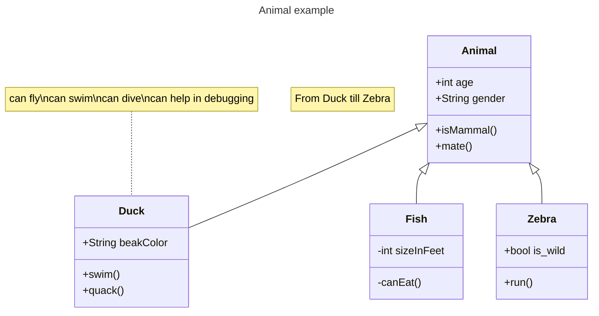

# TowerDefenseTemplate
Dit is een template wat door jullie te gebruiken is voor het juist inleveren van alle producten voor de Towerdefense beroepsopdracht. **Verwijder uiteindelijk de template teksten!**

Begin met een korte omschrijving van je towerdefense game en hoe deze werkt. Plaats ook een paar screenshots.
Er is een enemy "Vleermuis" die je moet vernietigen voordat het de rode orb oppakt, je kan dat doen met de grote kasteel in het midden die arrows schiet en je kan de tower verplaatsen.

## Product 1: "DRY SRP Scripts op GitHub"

Plaats hier minimaal 1 link naar scripts die voldoen aan de eisen van **"Don't Repeat Yourself (DRY)"** en **"Single Responsibility Principle"**.
Omschrijf hier waarom jij denkt dat je in die scripts aan deze eisen voldoet.

# DRY
Hier heb ik niet mee gewerkt omdat ik er niet aan toe kwam om mijn ideeën optijd toe tevoegen aan mijn game.

Maar als ik een wave system had toegevoegd aan mijn game zou ik een array gebruiken omdat ik mezelf dan niet hoef te herhalen en dan met 1 code alle enemies kan laten spawnen.

# SRP
In mijn script "Enemy" staat er dat als de health onder 100 is dat de enemy dood gaat en het wordt dan destroyed.

[link naar script](/DreamChase/Assets/Scripts/Enemy.cs)"*

## Product 2: "Projectmappen op GitHub"
Dit is de [ROOT](/DreamChase/) folder van mijn unity project.

Zorg dat deze verwijst naar je Develop branch.

## Product 3: Build op Github

Je maakt in Unity een stabiele “build” van je game waarbij bugs en logs eerst zijn verwijderd. Deze buildfiles upload je in je repository onder releases.  Bij eventuele afwijkingen moeten deze worden gedocumenteerd in de release. (Bijv controller nodig of spelen via netwerk etc..) 

[Release Voorbeeld](https://github.com/erwinhenraat/TowerDefenseTemplate/releases)

## Product 4: Game met Sprites(animations) en Textures 

De build van je game bevat textures, sprites en sprite animations(bijv particles) die op de juiste manier zijn gebruikt en zorgen voor een goede afwerking van je game.  

Plaats in je readme een animated gif van je gameplay (+- 10 sec.) waarin de implementatie van je textures en sprites goed te zien is.

## Product 5: Issues met debug screenshots op GitHub 
Ik heb geen issues aangemaakt van mijn bugs.

Zodra je bugs tegenkomt maak je een issue aan op github. In de issue omschrijf je het probleem en je gaat proberen via breakpoints te achterhalen wat het probleem is. Je maakt screenshot(s) van het debuggen op het moment dat je via de debugger console ziet wat er mis is. Deze screenshots met daarbij uitleg over het probleem en de bijhorende oplossing post je in het bijhorende github issue. 
[Hier de link naar mijn issues](https://github.com/erwinhenraat/TowerDefenseTemplate/issues/)

## Product 6: Game design met onderbouwing 

Je gebruikt een game design tool om je game design vast te leggen en te communiceren. Daarnaast onderbouw je de design keuzes ten aanzien van “playability” en “replayability” voor je game schriftelijk. 

Voorbeeld van een one page design:

Omschrijf per mechanic welke game design keuzes je hebt gemaakt en waarom je dit hebt gedaan.

*  **Je game bevat torens die kunnen mikken en schieten op een bewegend doel.** 
Ik heb een toren het is een kasteel en je kan de heletijd schieten. Er zijn unlimited arrows waarmee je kan schieten waardoor de enemy sneller dood kan gaan. Ook kan je 360 graden ronddraaien met je muis en kan je nog steeds schieten.

*  **Je game bevat vernietigbare vijanden die 1 of meerderen paden kunnen volgen.**  
De enemy volgt een pad en moet de orb oppakken om te kunnen winnen dus het volgt de hele map rond.

*  **Je game bevat een “wave” systeem waarmee er onder bepaalde voorwaarden (tijd/vijanden op) nieuwe waves met vijanden het veld in komen.**

*Ik heb geen wave system.*

*  **Een “health” systeem waarmee je levens kunt verliezen als vijanden hun doel bereiken en zodoende het spel kunt verliezen.** 

*Telkens als de enemy wordt geraakt gaat er 10 health van de healthbar af.*

*  **Een “resource” systeem waarmee je resources kunt verdienen waarmee je torens kunt kopen en .evt upgraden.**

*Ik heb dit niet.*

*  **Een “upgrade” systeem om je torens te verbeteren.**

*Ik heb dit niet.*

*  **Een “movement prediction” systeem waarmee je kan berekenen waar een toren heen moeten schieten om een bewegend object te kunnen raken. (Moeilijk)**

*Ik heb dit niet.*

## Product 7: Class Diagram voor volledige codebase 

Je brengt je volledige codebase in kaart met behulp van een class diagram. Binnen de classes hoeven geen private members te worden weergegeven. Wel alle public members (fields en methods). Ook geef je indien relevant de relaties tussen je classes weer. Je class diagram plaats je in je readme op github. Evt mag je dit doen m.b.v de [“Mermaid”](https://mermaid.js.org/syntax/classDiagram.html) tool.

## Product 8: Prototype test video
Ik heb geen werkende prototype gemaakt om een idee uit te testen.

Je hebt een werkend prototype gemaakt om een idee te testen. Omschrijf if je readme wat het idee van de mechanics is geweest wat je wilde testen en laat een korte video van de gameplay test zien. 

## Product 9: SCRUM planning inschatting 
[Link naar de openbare trello](https://trello.com/b/v92Lbu4Y/dreamchase)

## Product 10: Gitflow conventions

Je hebt voor je eigen project in je readme gitflow conventies opgesteld en je hier ook aantoonbaar aan gehouden. 

De gitflow conventions gaan uit van een extra branch Develop naast de "Master"/"Main". Op de main worden alleen stabiele releases gezet.

Verder worden features op een daarvoor bedoelde feature banch ontwikkeld. Ook kun je gebruik maken van een hotfix brancg vanaf develop.

Leg hier uit welke branches jij gaat gebruiken en wat voor namen je hier aan gaat meegeven. Hoe vaak ga je comitten en wat voor commit messages wil je geven?

Meer info over het gebruiken van gitflow [hier](https://www.atlassian.com/git/tutorials/comparing-workflows/gitflow-workflow)

